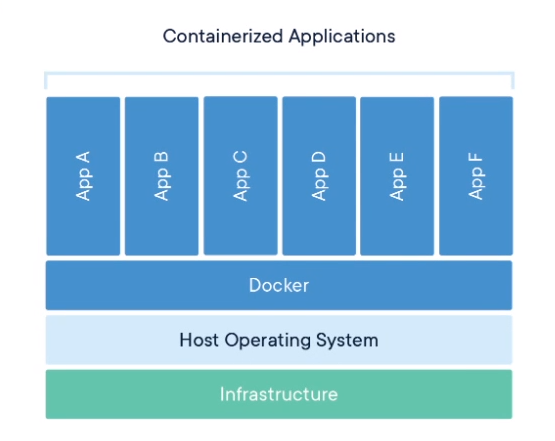

# DOCKER

> _an open-source project that automates the deployment of software applications inside **containers** by providing an additional layer of abstraction and automation of **OS-level virtualization** on Linux._

É uma ferramenta para a construção de containers, evitando ter que se preocupar com configurações de serviços para a aplicação. Permite usuário a criar **ambientes independentes e isolados** para lançar e deploy suas aplicações, esses ambientes são chamados de **`containers`** e basta um usuário rodar o container que irá configurar o ambiente na outra máquina.

Docker não é uma **Máquina Virtual** (MV), embora seja semelhante, o docker não irá incluir um sistema operacional completo agindo como um computador, ele irá somente **compartilhar recursos da máquina Host** através dos containers com fins de rodar o ambiente. Ou seja, irá compartilhar os recursos da máquina em que o Docker está instalado.

> Empacota códigos e todas as dependências de uma aplicação fazendo com que a mesma seja executada de um ambiente para outro.

Mesmo sistema operacional, compartilhando recursos da máquina host

<aside>
✍🏾 O que roda localmente roda em produção

</aside>

## Casos de uso

Útil para deploy aplicações com arquiteturas complexas de forma mais rápida devido ao padrão infraestrutura como código.

# CONTAINER

<aside>
🤯 Imagine a imagem como uma classe em OOP e um container como sendo o objeto.

</aside>

Quando roda uma imagem ela irá rodar em um container, e um container usa o kernel do linux da máquina host, o que é diferente de uma máquina virtual no qual cada máquina virtual criada irá estar rodando em um kernel específico.

<aside>
📝 Uma forma de empacotar a aplicação com todas as dependências e configurações necessárias.

</aside>

> **Imagens:** instruções para criação de um container (PostgreSQL, Mysql, Redis...)
> **Container:** Ambiente isolado na máquina (isola recursos como : CPU, memória, Disco, network, processos…). Cada container é um conjunto de processos “leves” que são rodados por um container runtime, formados por **Namespaces** (Processos isolados dos outros), **Cgroups** (Processos com controle de recursos do sistema operacional), **File System** (Compartilhamento de pedaços).




<aside>
⚠️ CONTAINERS são imutáveis, se morrer irá perder tudo. Neles possuem todas as informações essenciais para a aplicação rodar.

</aside>

O processo irá ser jogado dentro de uma **Namespaces** , ou seja, dentro de um local fechado no qual não irá ter acesso a outros processos do sistema operacional.

> Namespaces é nada mais nada menos do que uma forma de isolar recursos da sua máquina, como network, disco, usuários, processos etc.

**Cgroups** → Controlar o limite dos recursos de **memória e cpu**, informando que tal container irá usar x da ram do sistema operacional...

**File System** → Quando se trabalha com Containers se usa o OFS (Overlay File System) .

Quando se faz alguma alteração na aplicação, ao invés de gerar novas dependências, o File System irá alterar só aonde houver alterações, evitando assim mais uso do disco e processamento.


Se atualizar a imagem do container myApp:v1, ao invés de alterar todas as outras dependências, irá atualizar somente o myAppp e reaproveitará as dependências.

Dentro da imagem do container há a última camada chamada `Read/Write` no qual possibilita a interação com o imagem, leitura, escrita de arquivos e comandos. Então todos os containers irão terem camadas que eu posso somente ler e também camadas que eu posso tanto ler como escrever.

Muito importante saber que por mais que eu possa ter vários container usando a mesma imagem, nenhum deles podem alterar a camada `readonly` da imagem, assim se for necessário algum container ter que fazer alguma escrita, tal operação irá ser feita em uma camada copiada da readonly.

Desta forma evita que se uma alteração for feita em uma imagem que está rodando em vários outros container, tal alteração não irá persistir na imagem base.

> Resumindo: Se eu pego uma imagem como o Apache e uso ela em diversos containers, esses containers não irão escrever nada na camada readonly dela, a escrita irá ser feita em uma camada feita só para isso que é a camad `Read/Write` e que irá ser exclusiva para cada container.

<aside>
⚠️ Se derrubar um container e subir outro, todas as modificações dentro container irão ser desfeitas, sendo “temporário” no qual ao ser eliminado consequentemente todos os arquivos irão ser eliminados também.

</aside>

# 😍 Vantagens

- Docker é mais rápido do que uma máquina virtual
- É multiplataforma, podendo iniciar o container em qualquer sistema
- Construção e desconstrução mais rápido dos containers
- Sem dificuldades na configuração do container, ou seja, uma vez configurado o ambiente dificilmente irá ser alterado novamente
- Muito mais fácil realizar o deploy da aplicação

# IMAGEM

- Especifica o que é necessário para a aplicação funcionar:
  - configurações
  - scripts
  - variáveis ambientes
  - binaries…
- Ao ser executada irá dar origem a um container

<aside>
📝 A partir do momento que pego uma imagem e rodo ela na máquina, irá estar rodando em um container.

</aside>

**Imagem:** Configurações preparadas que a aplicação precisa é feita uma vez no dockerfile e apartir dele irá criar uma imagem, caso executar o comando `docker build`.

A imagem é um **template** / modelo no qual é especificado o sistema operacional, dependências e regras e tudo isso irá ser disponibilizado para o uso do container.


No exemplo acima vemos uma imagen que possuem vários conjuntos que são usadas para rodar a aplicação, se por acaso for necessário criar uma nova versão, o docker irá tentar ver quais desse conjuntos já possui e quais dependências já existem no outro container para assim evitar gastar mais armazenamento do disco.

O compartilhamento de pedaços de imagens é realizado, evitando usar exacerbado do disco.

<aside>
⚠️ Se eu tiver 10 containers executando baseado em uma imagem X, o que o docker irá fazer é usar essa mesma imagem para todos, fazendo com que não crie a mesma imagem 10 vezes por container. Isso só se torna possível por que a imagem tem uma camada `READONLY` no qual faz com que cada container para registrar tais logs, informais etc só pode fazer escrita criando uma cópia dessa camada e executando tais comandos nessa cópis, assim tornando cada container independente mesmo usando a mesma base da imagem.

</aside>


Note que acima eu não irei ter 4 containers com 4 imagens diferentes e cada uma com 500 mb,. O que irá acontecer é cada container usar a mesma imagem base do ubuntu, e cada um ir adicionando camadas de escritura e leitura exclusivamente.

<aside>
⚠️ Sempre que se altera uma imagem irá realizar uma cópia dela e depois irá acrescentar ao que está sendo executado no host.

</aside>

Um coisa interessante que acontece com o docker é que se eu instalar uma versão de uma imagem e depois quiser mudar de versão, o docker irá verificar só o que falta instalar e irá instalar só os arquivos restantes.


<aside>
⚠️ Uma imagem nunca se modifica

</aside>

### Image Registry

> Coleção de imagens hospedadas e rotuladas que juntas permitem a criação do sistema de arquivos de um container.

Local em que ficam as imagens.


Note que um registro pode ser tanto público como privado. Quando é público pode se montar imagens a partir de um repositório de imagens de acesso livre, mas quando for privado esse acesso será restringido.

Ao rodar o comando e chegar no `FROM` do dockerFile, irá realizar o `pull` da imagem no registro de imagem. Quando fizer uma build da imagem e realizar o `push`, irá registrar a minha nova imagem com estado imutável no registro de imagens.

# 📃 DockerFile

Construção da imagem através de um arquivo.

```docker
FROM: ImageName
RUN: Comandos ex: apt-get install
EXPOSE:8000
```

Ao fazer a **build** dessa imagem irá gerar a imagem com estado imutável. Para rodar a imagem basta executar o comando `RUN` e com isso ela irá estar rodando em um porta exposta no caso 8000.

# Como funciona?

Ao executar comando como run, pull, push no docker, o que irá acontecer na verdade é que você estarará executando o `Docker Client` e ele irá chamar/interagir com a API do `Docker Host`, no caso o Docker daemon.


### Docker Client

> Aceita comandos do usuário e passa esses comandos para o Docker Daemon API

Onde você executa comandos, ou seja, o que você vai rodar no terminal será ele.

### **Docker Host**

Docker host irá possuir `Volumes`, `Cache`, `Daemon - API` e `Network`

**Cache** ⇒ Ao realizar o pull do registro de imagem (Registry) irá salvar todas as imagens em cache, ou seja, o docker irá baixar as imagens do registry e salvar todas que estão sendo usadas no momento. Para evitar com que a cada realização do comando de rodar o docker tenha que fazer o download de todas as imagens novamente.

**Volumes** ⇒ Você irá conseguir compartilhar volumes de disco do PC com o container. Ao realizar a modificação no Container, irá modificar no Computador, assim como vice-versa.

Como o Container é imutável, ao usar os volumes você irá evitar problemas de perder arquivos ao matar o container.

**Network** ⇒ Irá ser possível a comunicação entre containers

### Docker HUB

Registro usado para hospedar e baixar imagens, servindo como uma plataforma de compartilhamento e gerenciamento de imagens.


---

# DOCKERFILE


- Possui instruções necessárias para criar um ambiente do server
- Contém scripts de instruções que o Docker usa para criar uma imagem do container

```docker
# syntax=docker/dockerfile:1
FROM python:3.7-alpine
#Especifico qual o contexto (PATH)
WORKDIR /code
ENV FLASK_APP=app.py
ENV FLASK_RUN_HOST=0.0.0.0
RUN apk add --no-cache gcc musl-dev linux-headers
# Copia de /code/requirements.txt e joga dentro da imagem
# substituindo o requeriments.txt dele.
COPY requirements.txt requirements.txt
# Com o RUN eu executo comando tanto em shell ou em exec
# e com ele eu crio registros/alterações.
RUN pip install -r requirements.txt
EXPOSE 5000
# Pego tudo que está no contexto, ou seja, no meu diretórios
# atual e jogo dentro do diretório da imagem.
COPY . . -> IRÁ COPIAR DO DIRETÓRIO ATUAL PARA O WORKDIR
CMD ["flask", "run"] ->Define um padrão para a execução do Container
```

<aside>
✍🏾 O Docker gera a build da imagem do Dockerfile, quando passa um `PATH` indica que a localização do contexto será a apartir do diretório do seu local filesystem (Diretório em que está o Dockerfile no projeto), já quando passa alguma `URL` indica que o contexto não será local e sim de um repositório GIT.

</aside>

```docker
#Gera a build da imagem a partir do contexto local em que está o DockerFile
# e manda para o docker daemon
docker build .
```

```docker
#Gera a build da imagem a partir da branch container pegando a pasta docker
docker build https://github.com/docker/rootfs.git#container:docker
```

Ou seja, ao fazer a build irá transferir o contexto, no primeiro exemplo foi usada o `.` para indicar que a build irá ser gerada da máquina local em que está Dockerfile para o Docker daemon.

## COMANDOS

### SHELL form vs EXEC form

- `SHELL`
  - Processa no shell
  - Executa `/bin/sh -c COMMAND`
    ```docker
    RUN apt-get install python3
    ```
- `EXEC`
  - É muito mais usado para CMD e ENTRYPOINT
  - Não executa no shell por padrão a não ser que invoque ele
    ```docker
    RUN ["apt-get", "install", "python3"]
    CMD ["/bin/echo", "Hello world"]
    ENTRYPOINT ["/bin/echo", "Hello world"]
    ```
  - Chama o executável diretamente

### **CMD**

- Define o comando padrão do container, porém **não irá ser executado em tempo de build**.
- Esses comandos especificados só irão serem rodados quando criar o container sem especificar um comando, caso contrário irá ser ignorado.
- Se definir múltiplos CMD, somente o último será executado

  ```docker
  CMD echo "Hello world"

  //resultado quando executa docker run -it <image>
  > Hello world

  //resultado quando executa docker run -it <image> /bin/bash
  > root@7de4bed89922:/# -> faz é rodar o interpretador bash
  ```

- Podem ser sobrescritos por _command lines arguments_
- Não irá executar diretamento o shell, ou seja, se for necessário rodar o comando `CMD [”echo”,”$HOME”]` para fazer substituição de variável, não irá funcionar. A não ser que invoque o shell diretamente não sendo pelo o docker `CMD [ "sh", "-c", "echo $HOME" ]`.
- Define os comandos para serem executados quando rodar a imagem, ou seja, **não irá executar nada em tempo de geração da build**, somente irá informar qual o comando pretendido para a imagem.

  ```docker
  #SHELL FORM
  FROM ubuntu
  CMD echo "This is a test." | wc -

  #EXEC FORM
  FROM ubuntu
  CMD ["/usr/bin/wc","--help"]
  ```

### **RUN →** Roda comandos e registra os resultados.

- Muito usado para baixar pacotes, libs que irão ser necessários para rodar a imagem.
- Executa comandos em cima da imagem atual e cria uma nova camada registrando os resultados.

# Atenção com o uso do RUN

```docker
FROM ubuntu
RUN apt-get install xxx << Executa tal comando em uma camada
RUN apt-get clean <<< Não irá funcionar pois irá ser executado em outra camada
```

Se eu pegar uma imagem e executar comandos para instalar pacote (apt-get install xxx), remover tal informação do pacote (apt-get clean), o segundo comando não irá funcionar por que a cada RUN que executa no dockerfile irá estar relacionado a uma camada readonly específica.

Essas regras tornam impossível com que o comando de desfazer tal operação ( que irá rodar em uma camada acima da criada pelo o comando anterior ) não consiga realizar sua função com sucesso pois a medida em que crio camadas, uma não pode alterar a outra pois são readonly.

O ideal é fazer da seguinte forma:

```docker
FROM ubuntu
RUN apt-get install xxx && apt-get clean << Executa os dois comandos na mesma camada
```

<aside>
⚠️ Comandos podem não serem executados se a imagem já tem entrado no cache.

</aside>

```docker
FROM busybox
RUN echo "Just echo while you work"
```

```docker
docker build -t example/run-echo .

Sending build context to Docker daemon  9.216kB
Step 1/2 : FROM busybox
 ---> be5888e67be6
Step 2/2 : RUN echo "Just echo while you work" <<<<<< Observe ele sendo executado
 ---> Running in ed37d558c505
Just echo while you work <<-------------------------------------------- echo executado
Removing intermediate container ed37d558c505
 ---> 6f46f7a393d8
Successfully built 6f46f7a393d8
Successfully tagged example/run-echo:latest
```

- Executa o comando padrão quando está construindo a imagem, registrando mudanças para o próximo passo.

### **COPY**

- Copia os arquivos que estão na minha máquina e joga dentro da imagem que irá ser criada.
- Copia arquivos ou diretórios do `src` e adiciona para o filesystem do container para o `dest`
- `dest` → Caminho absoluto ou relativo para `WORKDIR` do container

```docker
#Adiciona o test.txt para o <WORKDIR>/relativeDir/
COPY test.txt relativeDir/
# Ou um caminho absoluto /absoluteDir/
COPY test.txt /absoluteDir/
```

### ADD

- Se for passado uma pasta, irá pegar somente os arquivos desta pasta no computador local e irá jogar no destino dentro do container

```docker
ADD <origem no computador local> <destino dentro do container>
```

### **ENTRYPOINT**

- Quando o container rodar, irá executar algum arquivo.
- Sempre os argumentos irão serem executados
- Se passar comandos via CLI na execução do container, não irá ignorar os comandos especificados no ENTRYPOINT

```docker
#Ao rodar o container irá executar o main
ENTRYPOINT ["./main"]
```

### Diferença entre CMD, ENTRYPOINT and RUN

link: [https://stackoverflow.com/questions/37461868/difference-between-run-and-cmd-in-a-dockerfile#:~:text=RUN is an image build,you launch the built image](https://stackoverflow.com/questions/37461868/difference-between-run-and-cmd-in-a-dockerfile#:~:text=RUN%20is%20an%20image%20build,you%20launch%20the%20built%20image).

### **WORKDIR**

Entra na pasta do container, caso não existir irá criar ela.

```docker
#Define um apelido para a imagem
FROM golang:alpine as builder
# Entrar no diretório do container
WORKDIR /go/src/
# Pega as pastas/arquivos do diretório atual e joga
#dentro do workdir
COPY . .
#Compila o arquivo gerando o binário para linguagem de máquina
RUN CGO_ENABLED=0 GOOS=linux go build -o /go/bin/server main.go

# Imagem vazia
FROM scratch
# Vai acessar da imagem builder criada acima
# pegando onde o arquivo compilado foi criado
# /go/bin/server e irá jogar dentro de /server da
# imagem scratch que irá ser vazia.
COPY --from=builder /go/bin/server /server
EXPOSE 8080
CMD ["/server"]
```

# DOCKER COMPOSE

### Por que usar isso?

No mundo real, uma aplicação mais complexa é composta por várias dependências que ao todo irá definir o funcionamento da minha aplicação, ou seja, meu programa que estou desenvolvendo precisa de uma infraestrutura que irá ser composta por vários serviços rodando em containers diferentes mas que ao todo formam a minha aplicação.

- Ferramenta que ajuda a definir e compartilhar múltiplos containers
- Define a stack da aplicação em um único arquivo


<aside>
📝 Docker compose irá se preocupar em criar uma Network comum entre os containers, não sendo necessário criar network no arquivo.

</aside>


Network padrão criada pelo o docker compose

> Sobe o projeto inteiro com um único comando, com base nos serviços (containers) especificados no docker-compose.yaml


> É um orquestrador de containers, definindo **como irá ser o funcionamento da aplicação**. Gerencia múltiplos containers ao mesmo tempo para a mesma aplicação.

Ele resolve o problema de por acaso a minha aplicação precisar rodar mais de um container de uma vez (MySQL, MongoDB, Redis...), e ter que ficar dando vários comandos de rodar, compartilhar volumes...

Com o docker compose você só precisa informar quais os serviços que irão serem usados na sua aplicação e o próprio docker irá rodar todos eles de forma automatizada.

Orquestrador de containers permite `**definir os serviços (containers) que irão rodar**`, se algum serviço depende de outros para rodar... ← Lógica dos serviços

Com o docker compose definido, basta que uma pessoa que possui o docker e docker-compose instalado na sua máquina execute os comando para rodar a aplicação na sua máquina, rodando todos os serviços sem ter que ter eles instalados.

<aside>
⚠️ No docker-compose.yml  descrevemos a **infraestrutura como código** e como ela vai ser comportar quando iniciado.

</aside>

```yaml
version: "3.9"
services:
	web: #Serviço 1
		# usa uma imagem criada a partir do Dockerfile no diretório atual para criar
		# a build
		build: .
		ports:
			#Vincual o Container e Máquina Hospedeira à porta 5000
			- "5000:5000"
	redis: #Serviço 2
			#Vai gerar a imagem do redis extraída do Docker HUB
			image: "redis:alpine"
```

Sempre que possível o docker usará cache para execução de processos de build da imagem, para acelerar a execução. Esse cache é gerado a partir de builds anteriores na máquina no qual está sendo realizado a criação.

# Volumes

<aside>
⚠️ Forma de persistir informações do container, pois quando o container é removido ou cai todas suas informações serão perdidas.

</aside>

No docker compose você pode informar que determinada pasta ou diretório irá ser compartilhado da sua máquina local para o container, ou seja, se mudar na máquina local irá alterar também no container e vice-versa.

> As informações ficam salvas independente do estado do container.

Ajuda muito em caso de antes eu perder o conteúdo do container quando for realizada alguma modificação, pois o conteúdo que está na minha máquina vai estar também no container.

```docker
docker container run -it -v <diretório local>:/<diretório no container> <imagem> <comando>
```

- É possível criar um volume com um nome específico, no qual irá guardar o estado do container.

  ```docker
  docker container run --name db -v dados-do-banco:/var/lib/mysql -e MYSQL_ROOT_PASSWORD=alura mysql
  ```

  No caso ao criar um volume informando apenas o nome dele, no caso acima é `dados-do-banco` irá ficar listado no diretórios `/var/lib/docker/volumes/`
  Se matar esse container, o volume irá ficar intacto, tornando possível que ao criar um novo container basta referenciar o volume e ele já irá ler os dados.

  ```docker
  docker container stop db

  docker container rm db //Volume irá existir ainda
  ```

- É possível criar volumes em outros diretórios, basta ao invés de informar o nome do volume especificar um diretório que irá ficar o volume.

  ```docker
  docker container run --name db -v /outro/diretorio/:/var/lib/mysql -e MYSQL_ROOT_PASSWORD=root -d mysql
  ```

  Usando o docker-compose

  ```yaml
  db: # Nome do primeiro container (o do mysql, equivalente ao --name do docker)
    image: mysql # Imagem que será usada para a criação deste container
    volumes:
      - <pasta host>/:/<pasta container>
    environment: # Variáveis de ambiente que iremos passar (o equivalente ao --e)
      - MYSQL_ROOT_PASSWORD=root123 # Este parâmetro "environment" aceita uma lista de variáveis com seus respectivos valores, estamos passando a senha do banco de dados

  blog: # Criamos outro container chamado "blog", que será o container do wordpress
    image: wordpress # Com a imagem do wordpress
    environment:
      - WORDPRESS_DB_PASSWORD=root123 # Passamos a senha do mysql para o WP
    links: # Criamos uma lista de links (equivalente ao --link do docker)
      - db:mysql # Aqui temos que passar o NOME do container que queremos linkar, o mesmo nome que colocamos na primeira linha
    ports: # Aqui definimos as portas que serão expostas, também é uma lista (equivalente ao --p)
      - 80:80 # E aqui definimos o comando com a porta local:porta container
  ```

```yaml
version:  '3'

services:
	nginx:
		image:nginx
		volumes:
			- ./nginx:/urs/share/nginx/html
		ports:
			- 8080:80
```


## 👨🏾‍💻 Principais comandos do docker-compose

```docker
#Executa o docker compose subindo o container
docker-compose up
#Executa o docker compose e deixa ele rodando mesmo se fechar o terminal (Em plano de fundo)
docker-compose up -d
#Exibir os logs do container observando ele
docker logs <Id ou tag do container> -f
#Exibir os logs do container observando ele
docker logs <Id ou tag do container>
#Exibir os últimos logs
docker logs <Id ou tag do container> | tail
#Parar o compose
docker-compose stop
#Parar todos os serviços do docker-compose
docker-compose stop
#remover o docker-compose
docker-compose down
#Inicia todos os serviços dentro do docker compose
docker-compose start

#Rodar um servico específico
docker-compose up -d <tag ou id do container>
```

Exemplo:

```docker
# Versão que vai ser utilizado no dockercompose
version: "3.7"
# Serviços necessários para rodar
services:
	# First service (container): the my-database.
  # Here you are free to choose the keyword.
  # It will allow you to define what the service corresponds to.
  # We use the keyword 'database-test' for the database.
  my-database:
    image: postgres
    container_name: database-test
    restart: always
    ports:
      - 5432:5432
      #Variáveis ambientes disponível na imagem
    environment:
      - POSTGRES_USER=postgres
      - POSTGRES_PASSWORD=1234
      - POSTGRES_DB=rentex
    volumes:
    # irá compartilhar os aquivos do banco de dados do pgdata e irá
		# compartilhar com o container dentro da pasta /data/postgres
      - pgdata:/data/postgres
    #Fazer com que os container trabalhem na mesma rede, evitando problemas de ip diferentes
    # networks:
    #   - my-proxy-net
  # Nome do serviço
  app:
    # Gerar build da imagem a partir da imagem já declarada pelo DockerFile
		# a partir do diretório atual (Contexto da imagem será da pasta que
		# está localizado o dockerfile)
    build: .
    container_name: app-container
    ports:
      # Definir o mapeamento de portas: Quando acessar a porta 3333 da minha máquina, irá acessar a 3333 do container
      - 3333:3333
    #Útil para compartilhar arquivos de sistma entre containers facilmente e fazer backup de dados
    #Ou seja, ao serem criado os dados irão ficar salvos mesmo se os containers forem destruídos, evitando perder dados
    #Tudo que o container armazena também irá ficar na máquina local, mesmo que o container deixe de existir
    volumes:
      # Pega as informações do diretório atual (.) e compartilha com o container
			# dentro do  /user/app
      - .:/user/app
      # allow docker to track changes when other packages are installed or removed https://stackoverflow.com/a/61296358/14068908
      - /user/app/node_modules/bcrypt/
    # networks:
    #   - my-proxy-net
networks:
  my-proxy-net:
    external:
      name: host
#Irá criar um volume que pode ser lido e escrito (Read/Write)
volumes:
  pgdata:
    driver: local
```

---

## Logar

Caso dê algum problema no docker relacionado a autorização, é só deslogar e logar de novo.

Pode ser tanto pela a ui do docker hub como também por via de comandos:

```jsx
docker logout
docker login -u user -p password
```

### Clonar

```docker
docker run --name repo alpine/git clone digitar_url
```

### Build (Criar a imagem)

Executar o dockerfile para gerar a imagem do container, para assim conseguir rodar a imagem

```docker
docker build -t nome da imagem_que_quiser_criar path
//ex: docker build -t rentex . (irá criar a imagem rentex baseado no diretório atual onde está o Dockerfile)
```

### 💫 Run

> Rodar determinada imagem e cria o container com base nela. **`Cria e roda o container`**.

```docker
docker run hello-world
```

`-p` mapeamento das rotas

`-d` (detach) Executar em background separado do terminal

`-t` (TTY) irá abrir um pseudo terminal, fazendo que você acesse determinado container como se tivesse abrindo uma máquina linux e aberto o terminal dela.

`-i` (interactive) deixar rodando em modo interativo permitindo interagir com determinados processos como o **bash** para executar shell script dentro de um container, visualizar os diretórios raízes, manipular arquivos…

```docker
docker run ubuntu /bin/bash
```

```docker
docker run -d -p 80:80 --name docker-tutorial imagem_que_quiser_criar
```

<aside>
⚠️ Toda vez que rodar docker run, irá criar um novo container. Se for executado o docker stop, irá deixar o container na lista de containers que foram parados, ou seja, fica acumulando.

</aside>

Usando a tag `-d` irá fazer com que o docker rote o container em background separado do terminal, ou seja, irá rodar o processo e deixará rodando e enquanto isso eu posso usar o terminal pois o processo está separado do terminal e estará rodando por baixo dos panos.

### EXEC

Através do exec é possível rodar comandos dentro de container que está executando.

```docker
docker exec nginx ls
```

```docker
#Irá acessar o container de forma interativa, entrando dentro do container
docker exec -it nginx bash
```


Através da forma interativa, irá ser possível acessar pastas, rodar comandos de instalação, modificar arquivos do container, etc. Ex:


```docker
apt-get update
apt-get install -y vim
vim index.html
```

### SUBIR A IMAGEM NO DOCKER HUB

Ao executar esse comando, o docker irá jogar a imagem criada para o docker registry / hub.

```docker
docker push usuário/<NOME DA IMAGEM OU ID>:latest
#rodar a imagem
docker run usuário/<NOME DA IMAGEM OU ID>:latest
```

```docker
# Listar todas as imagens que foram montadas
docker images
# Apagar a imagem que foi montada, cuidado que ao fazer isso
#Irá ser necessário montar a imagem de novo para usá-la.
docker rmi <NOME DA IMAGEM>
# Informações sobre os containers que estão de rodando
docker ps ou docker container ls
#Listar container que estão rodando e não estão rodando
docker ps -a
# Acessa o terminal do container
docker exec -it nome_container /bin/bash
docker exec -it container_id bash
#Visualizar pastas
ls
#Para a execução do container
docker stop CONTAINER_ID
# Remove o container
docker rm -f CONTAINER_ID
#iniciar um container que estava parado
docker start CONTAINER_ID
#checar o ip do container
docker exec container-name cat /etc/hosts
# Detalhes do container
docker inspect nome-container
#Mostrar volumes
docker volume ls
#deletar volumes
docker volume rm nome_volume
#deletar volumes que não estão sendo usados
docker volume prune

#GERAR A IMAGEM A PARTIR DO DOCKERFILE
docker build -t <NOMEAÇÃO PARA A IMAGEM> . (O . indica que o dockerfile está no diretório atual)
#RODAR O CONTAINER CRIADO
docker run <NOMEAÇÃO DO CONTAINER CRIADO>:latest
#RODAR O CONTAINER JÁ REDIRECIONANDO AS PORTAS DA MÁQUINA LOCAL COM O CONTAINER
docker run -p porta:porta <NOMEAÇÃO DO CONTAINER CRIADO>:latest
#EXECUTAR O CONTAINER E QUANDO FINALIZAR REMOVER SOZINHO
docker run --rm -d -p porta:porta <nome ou id do container>
```
