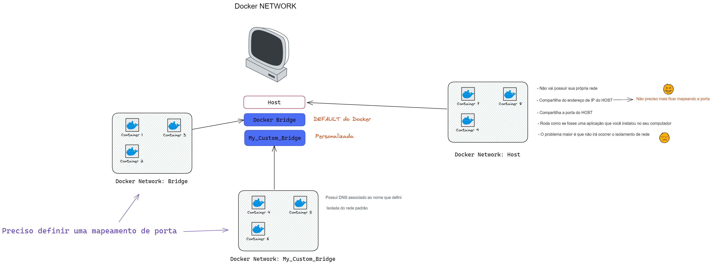

# Network

Docker cria redes isoladas onde os containers irão estar rodando. 

## Por que usar?

- Quando estiver trabalhando em um host que irá possuir vários containers rodando ao mesmo tempo, você irá necessitar configurar o acoplamento e comunicação entre tais containers na mesma rede.
- Conectar containers e services
- Dá mais segurança para a comunicação de tais containers
- Por padrão o docker irá criar 3 intarfaces de rede virtual
- É plugável (conectável) por meio de drivers (Tipos de redes) possuindo três principais drivers: Bridge, Host e None (Null).
    
    
    
    # `BRIDGE`
    
    - Rede padrão dos containers
    - Permite a comunicação interna entre os containers
    - Irá isolar a network do container com virtual ip address
    - Se quiser acessar o container por fora, irá ter que fazer o **mapeamento das portas**
    - Interface virtual que conecta todos os containers para o docker host network
    - Faz **`NAT`** com a rede hospedeira
        - Permitindo acessar a internet
    - Docker inclusive recomenda usar uma `Custom Bridge` em produção, pois você basicamente pode realizar `ping` apenas passando o nome da rede customizada e o **`DNS`** irá resolver. E isso é importante pois como o ip do container por padrão irá mudar frequentemente, é muito mais fácil realizar conexões de container pelo o nome da rede.
    
    <aside>
    ⚠️ Ao criar um network `Bridge customizado`, o docker irá isolar esse custom bridge de todas as outras networks, mantendo a network com o host. Por exemplo, se tentar acessar o ip de um container com outra network, não irá ser possível mas se acessar o ip da máquina host irá conseguir.
    
    </aside>
    
    # `HOST`
    
    - Mesmo IP do container irá ser usado na máquina
    - Não precisa publicar portas ( mapear usando -p ou -P)
    - Não consegue iniciar vários containers com a mesma porta
    - Não funciona no SWARM
    - Quando não quiser isolar o container com um ip virtual, e sim fazer com que o container se comunique com a network do host diretamente, como por exemplo, conectar a outras aplicações que não são executadas no docker e sim na máquina host.
    - Remove o isolamento do host
    - Não precisa fazer o mapeamento das portas por que o container irá estar rodando na mesma network do host, não tendo uma interface virtual
    
    # `NONE`
    
    - Não possui acesso externo e nem de outros containers
    - Totalmente isolado e totalmente segura

# Outros drivers

## MAC-VLAN


## IP-VLAN Layer 2


## IP-VLAN Layer 3


## Overlay Network

## Comandos do docker

```docker
docker network connect     Connect a container to a network
docker network create      Create a network
docker network disconnect  Disconnect a container from a network
docker network inspect     Display detailed information on one or more networks
docker network ls          List networks
docker network prune       Remove all unused networks
docker network rm          Remove one or more networks
```

Usando a tag `—net` você consegue especificar qual a network que irá usar

# Comandos e conceitos importantes sobre rede

](imgs/Untitled%207.png)

Interfaces de rede, wifi, virtual  e entre outros. Fonte: [https://www.cyberciti.biz/faq/linux-list-network-interfaces-names-command/](https://www.cyberciti.biz/faq/linux-list-network-interfaces-names-command/)

`lo` → Loopback Interface.

`eht0` → My first Ethernet network interface in linux. In modern linux might be renamed as `enp0s31f6`.

`wlan` → Wireless network interface in linux or `wlp82s0`.

`ppp0` → Point to Point protocol network interface.

`vboxnet0` , `vmnet1`, `vmnet8` → Virtual machine interface.

### Commandos importantes

